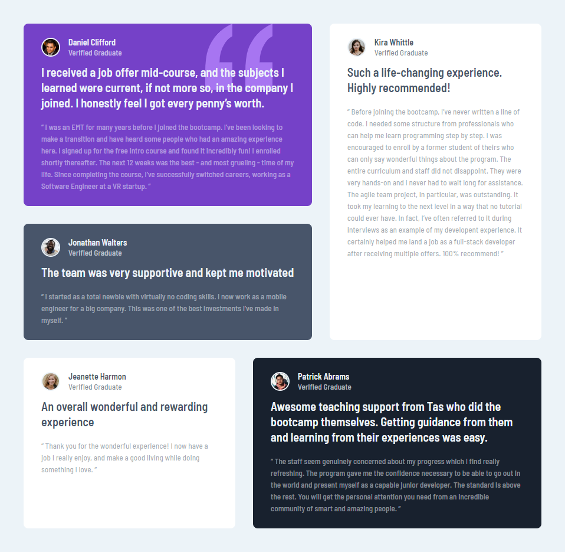
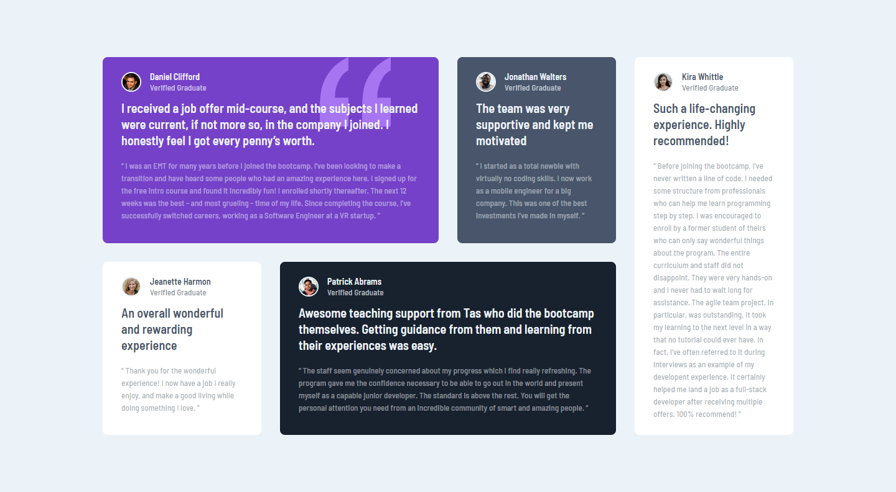

# Frontend Mentor - Testimonials grid section solution

This is a solution to the [Testimonials grid section challenge on Frontend Mentor](https://www.frontendmentor.io/challenges/testimonials-grid-section-Nnw6J7Un7). Frontend Mentor challenges help you improve your coding skills by building realistic projects. 

## Table of contents

- [Overview](#overview)
  - [Screenshot](#screenshot)
  - [Links](#links)
- [My process](#my-process)
  - [Built with](#built-with)
  - [Continued development](#continued-development)
- [Author](#author)

## Overview
### Screenshot

- Mobile Version

- Tablet Version

- Desktop Version

### Links

- Solution URL: [solution](https://www.frontendmentor.io/solutions/responsive-testimonial-design-using-css-grid-5th2bfnKE)
- Live Site URL: [Live Site](https://marif0025.github.io/testimonial-grid-template/)

## My process

### Built with

- Semantic HTML5 markup
- CSS custom properties
- CSS Grid
- Mobile-first workflow

### Continued development

Since sketch or figma file was not provided in free version, so there is litle bit difference in margins and fonts.

## Author

- Website - [Github Profile](https://github.com/marif0025)
- Frontend Mentor - [@marif0025](https://www.frontendmentor.io/profile/marif0025)
- Twitter - [@iamarif005](https://www.twitter.com/iamarif005)
